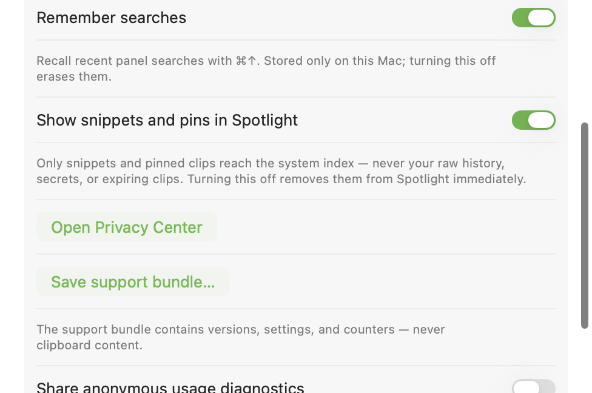

# Gancho — Smart Clipboard

> Your clipboard, everywhere — private by design. Gancho is a local-first
> clipboard history and curated snippet library for Mac, iPhone, iPad, and the
> rest of the Apple platform family, built so future non-Apple clients can join
> without rewriting the core.
>
> *Gancho* means “hook” in Spanish: it is where you hang everything you copy.
> And when something *tiene gancho*, it hooks you.

**[gancho.app](https://gancho.app)** · [Releases](https://github.com/johnny4young/gancho/releases) · [Changelog](CHANGELOG.md)

[](https://github.com/johnny4young/gancho/actions/workflows/ci.yml)
[](https://github.com/johnny4young/gancho/releases/latest)
[](LICENSE)


**Status: in active development (pre-release).** The capture engine, local
GRDB/SQLite storage with FTS5 search, the Liquid Glass history panel,
paste-back, pins and boards, the retention engine, the on-device intelligence
stack, the iPhone/iPad app and its extensions, iCloud sync via `CKSyncEngine`,
and StoreKit purchase plumbing are implemented and covered by tests. Serialized
purchase and restore automation verifies entitlement changes end to end. The
release/versioning lane ships a signed, notarized, stapled direct-download DMG,
a signed Sparkle appcast, version-sync guards, artifact QA, and the website. The
v0.7.0 DMG ships through the same signed, notarized, stapled lane that produced
the Gatekeeper-accepted v0.6.0 artifact; acceptance is re-verified per published
release. What remains before 1.0 is repeating the real-device sync matrix for
the release candidate, moving direct-license issuance outside distributed
builds, validating CloudKit production recovery, App Store submission, and the
account-gated launch pieces (App Store products and TestFlight).

## Contents

- [Unreleased on main](#unreleased-on-main)
- [What's new in 0.7](#whats-new-in-07)
- [Product goal](#product-goal)
- [Platform plan](#platform-plan)
- [Current capabilities](#current-capabilities)
- [Setup (< 10 min)](#setup--10-min)
- [Layout](#layout)
- [Privacy invariants](#privacy-invariants)
- [Contributing](#contributing)
- [Acknowledgements](#acknowledgements)
- [License](#license)

## Unreleased on main

- **Bring an existing history with you.** A guided Mac import previews Maccy
  archives or CSV files before writing, rejects protected and malformed rows,
  deduplicates atomically, supports cancellation, and finishes with an exact
  imported/skipped summary.
- **Give each local AI client only the context it needs.** MCP access now uses
  expiring, revocable per-client grants with an explicit board/time context,
  independent read/write policy, fail-closed SQL filtering, and a content-free
  access ledger. No process can fall back to ambient history.
- **Make first value visible without pre-consent tracking.** Onboarding records
  only closed, content-free activation milestones locally; optional diagnostics
  receive one coarse aggregate only after explicit consent.
- **See private reuse without creating another history.** The Privacy Center on
  Mac, iPhone, and iPad shows bounded per-app capture, reuse, protected/ignored,
  and sensitive-expiry totals. The receipt stays on that device for 13 rolling
  months, never syncs or exports, and has an independent clear action.

## What's new in 0.7

- **Batch the busywork on Mac.** Select a range with Shift or build a selection
  with Command-click, then send every clip to the paste stack, file them into a
  board, or delete them with one shared Undo. A selected group of file clips
  also drags to Finder as one de-duplicated file set.
- **Find the Library from Spotlight.** Curated snippets and pins are searchable
  across Mac, iPhone, and iPad while raw history, secrets, and expiring clips
  stay out of the system index. One switch removes Gancho's Spotlight domain.
- **Keep secrets outside the model.** Deterministic structural redaction now
  replaces key-, token-, card-, and private-key-shaped text before on-device AI
  sees it; every prompt is versioned and covered by an opt-in live evaluation.
- **Stay fast as the Library grows.** Boards page through thousands of clips,
  semantic vectors carry their model version for safe background refreshes,
  and bounded top-K selection brings measured 10k-vector retrieval p95 below
  30 ms.
- **Never lose the way back to Gancho.** The menu-bar affordance recovers after
  helper failure and the history process terminates if no affordance survives;
  bare JWT previews are masked without disabling decode or paste.



*Real macOS v0.7 build captured by XCUITest. Spotlight indexing is explicit,
limited to the curated Library, and immediately reversible.*

## Product goal

Gancho should become the private memory layer for everything people copy and
reuse. Its launch wedge can target developers and power users first, while the
product language remains broad enough for anyone who repeatedly copies work
between devices:

- **Capture safely.** Automatic on macOS, intentional on iOS/iPadOS/visionOS,
  with sensitive pasteboard markers vetoed before any content read.
- **Retrieve instantly.** Exact, fuzzy, and regex history search first; local
  semantic retrieval then grounds Q&A and smart organization.
- **Reuse anywhere.** Paste-back, snippets, templates, pins, and App Intents
  make captured work reusable without changing context.
- **Sync without servers by default.** Apple-platform sync uses the user's
  iCloud account through a `SyncEngine` boundary; future transports plug into
  the same boundary.
- **Earn trust visibly.** No clipboard content in logs, telemetry, diagnostics,
  or error reports — ever.

## Platform plan

| Platform | Role | Capture model |
| --- | --- | --- |
| macOS | Primary creation surface | Automatic pasteboard monitoring with adaptive polling |
| iOS | Companion and capture surface | Share Extension, `UIPasteControl`, foreground actions, App Intents |
| iPadOS | Power companion | iPad-native navigation and keyboard workflows |
| visionOS | Apple ecosystem coverage | iPad-compatible build first; native spatial UI only if usage justifies it |
| watchOS | Lightweight viewer | Pins/recent items only; watchOS has no pasteboard API |
| Android / Windows / Linux | Future analysis only | Capability matrix and portable data envelope research; no implementation commitment yet |

The engineering rule is simple: platform-specific capture/UI code stays at the
edges; models, privacy policy, storage/search contracts, sync, and intelligence
stay in reusable modules.

## Current capabilities

**Capture & privacy**

- macOS pasteboard monitor: adaptive low-power polling, screen-lock and
  private-mode pause, own-write suppression, Universal Clipboard badge, rich
  payloads (text, RTF, HTML, image, file URLs), lossless bursts, off-main reads.
- Sensitive `org.nspasteboard` types (`ConcealedType`, `TransientType`,
  `AutoGeneratedType`) veto capture before any content read; preloaded
  password-manager / banking denylist; "ignore next copy".
- On-device sensitive-data detector (cards via Luhn; AWS/Stripe/GitHub/Slack
  keys; PEM keys; probable passwords) with masked previews and short expiry.
- Retention engine: global and per-kind expiry, sensitive auto-expire, pins
  exempt, background purge.

**Storage & search**

- GRDB/SQLite store with content-addressed disk blobs, lazy thumbnails, paged
  metadata-only lists, versioned migrations, device-aware dedup, and
  always-available JSON/CSV export.
- FTS5 full-text search (exact / fuzzy / regex; filters by kind, source app,
  date) with dedicated short-prefix indexes so fuzzy recall stays responsive
  while typing. The 100k-item performance harness measures cold startup and
  reproducible warm rounds separately.
- A 512-dimension on-device embedding index used by Ask your clipboard and
  auto-board suggestions. Main history search remains FTS5 exact/fuzzy/regex.

**macOS app**

- Menu-bar agent and Liquid Glass floating panel (⇧⌘V): keyboard-first,
  type-to-search, composable source/kind/board/date filters, editable titles and
  explicit Save/Cancel text refinement, per-kind previews, a privacy-safe
  read-only full-content preview (⌘Y), paste-back via synthetic ⌘V
  (layout-aware keycodes, plain-text paste, restore-previous), onboarding,
  Settings, and the Privacy Center.
- Pins and boards (multi-membership collections) and a unified Library for
  boards and snippets. Boards can use a fixed accessible color and an optional
  emoji identity that persists and syncs across Mac, iPhone, and iPad. A local,
  one-time suggestion offers to promote a clip to a snippet after its third
  successful reuse.
- Multi-selection via Shift or Command-click, with batch add-to-stack,
  add-to-board, and delete-with-Undo actions. Selected file clips drag together
  as independent file URLs when the whole selection is file-safe.
- Curated snippets and pins can be donated to Spotlight with structural
  redaction and a Settings switch that removes Gancho's system index immediately.
- Guided Maccy/CSV history import uses a read-only preview, source validation,
  atomic deduplication, cancellation, and a content-free final summary.

**iPhone & iPad app**

- Intentional capture only: Save button, `UIPasteControl`, Share Extension, and
  App Intents / Shortcuts. Keyboard extension with history, widgets, iPad split
  view, source-app filtering, editable clip titles and text, and on-device
  enrichment of clips captured on the device.

**On-device intelligence** (zero network — every tier runs on the device)

- Deterministic tier-0 classifier — 17 kinds (URL, email, phone, address, date,
  color, JWT, JSON, UUID, code + language, credit card, tracking number, …) in
  under 5 ms.
- Apple Intelligence titles (fallback-safe), screenshot OCR, and semantic
  indexing for grounded Q&A and board suggestions — each behind a per-stage
  toggle on the Intelligence screen.
- Dev Actions (JWT decode, JSON pretty/minify, Base64, URL parse, color
  conversion, UUID formats), also exposed as App Intents.
- Smart Paste — rewrite a clip before pasting (summarize, fix grammar, change
  tone, key points), translate, and redact PII — all on-device and secret-safe.
- Ask your clipboard — grounded Q&A over history (semantic retrieval + the
  on-device model), with sensitive clips filtered out.
- Auto-board — suggest the board a clip belongs to from its semantic neighbors.

**Sync & integrations**

- `CKSyncEngine` over the user's private iCloud database behind the `SyncEngine`
  boundary (clips, board membership, deletions) with a visible sync status. A
  real-device cross-device pass has completed; the matrix is repeated for each
  release candidate.
- `gancho` CLI and a local, opt-in MCP server with expiring, revocable
  per-client grants, explicit board/time context, independent read/write
  permission, and a metadata-only access log, plus a VS Code "Save Selection"
  command — see
  [docs/INTEGRATIONS.md](docs/INTEGRATIONS.md).

**Monetization & operations**

- StoreKit 2 purchase / restore / entitlement plumbing with a contextual paywall
  and free-tier limits (the App Store products are owner-gated).
- Optional anonymous diagnostics, disabled until explicit consent and limited
  by type to metadata buckets; crash and support bundles remain content-free.
- Content-free activation milestones remain local before consent, and the
  independent private activity receipt exposes bounded per-app totals without
  syncing, exporting, or retaining clipboard content.

**Engineering**

- XcodeGen project; Swift 6 strict concurrency (app targets `@MainActor`,
  engine-room targets nonisolated + `Sendable`); a bilingual (English + Spanish)
  String Catalog gate; accessibility (VoiceOver, Dynamic Type,
  reduce-transparency); and shared platform-neutral coordinators in
  `GanchoAppCore` behind durable store and transport-neutral sync boundaries.
- CI covers build/test/lint, an enforced production-source coverage floor,
  serialized StoreKit purchase/restore automation, and scale performance.

## Setup (< 10 min)

Prerequisites: macOS 26+, Xcode 26+, and
[XcodeGen](https://github.com/yonaskolb/XcodeGen) (`brew install xcodegen`).

```bash
git clone https://github.com/johnny4young/gancho.git
cd gancho
make hooks   # install the pre-commit lint hook once per clone
make test    # package unit tests (Swift Testing)
make open    # generate Gancho.xcodeproj and open Xcode
```

| Target | What it does |
| --- | --- |
| `make project` | Regenerate `Gancho.xcodeproj` from `project.yml` |
| `make build` | Build the macOS app (unsigned Debug) |
| `make build-ios` | Build the iOS app (unsigned Debug, generic device) |
| `make install-ios` | Build the iOS app team-signed and install it on the connected iPhone/iPad |
| `make test` | Run package unit tests |
| `make coverage` | Run package tests with coverage and enforce the production-source floor |
| `make test-storekit` | Run serialized StoreKit purchase/restore entitlement automation |
| `make test-ui` / `make test-ui-ios` | Run the macOS / iOS XCUITest suites |
| `make release-check` | Verify `project.yml`, `CHANGELOG.md`, and release templates are in sync |
| `make package-macos` | Build `dist/Gancho-<version>.zip` for release QA |
| `make qa-release` | QA the newest release ZIP, or `ARTIFACT=/path/to/Gancho.app` |
| `make site-check` | Verify the static website and its product-truth contract under `site/` |
| `make format` / `make lint` | Format / verify Swift sources |
| `make hooks` | Install the versioned pre-commit lint hook |
| `make clean` | Remove generated project and build artifacts |
| `make open` | Generate and open the Xcode project |

### Run on a real device

The keyboard, widgets, and the "ready to paste" Live Activity only come alive on
hardware. Plug in an iPhone/iPad, trust the Mac, then:

```bash
make install-ios                      # auto-detects the connected device
make install-ios IOS_DEVICE=<uuid>    # or target one explicitly
make install-ios DEVELOPMENT_TEAM=<team-id>
```

`make install-ios` team-signs the build (Xcode-managed provisioning, so the app
and its extensions get profiles on first run) and installs it with `devicectl`.
The Makefile defaults to the maintainer's development team, but forks and CI can
override `DEVELOPMENT_TEAM` without editing the file. Open Gancho on the device
from the Home Screen. List devices and their UUIDs with
`xcrun devicectl list devices`. After installing, enable the keyboard in
Settings → General → Keyboard → Keyboards → Gancho (turn on Full Access for clip
history), and Live Activities under the Gancho app's settings.

### Release and website workflow

Release metadata is intentionally boring and synchronized:

- `project.yml` owns `MARKETING_VERSION` and `CURRENT_PROJECT_VERSION`.
- `CHANGELOG.md` keeps `[Unreleased]` plus the newest released `## [x.y.z]`
  entry matching `MARKETING_VERSION`.
- `.github/workflows/release.yml` gates tagged `v*` releases with
  `make release-check`, lint, tests, macOS build, iOS build, packaging, and
  artifact QA before attaching `dist/Gancho-<version>.zip`.
- `.github/workflows/pages.yml` deploys the landing from `site/` to Cloudflare
  Pages (`https://gancho.app`) and keeps the signed Sparkle appcast on GitHub
  Pages (`https://johnny4young.github.io/gancho/appcast.xml`, the app's feed URL).

See [CHANGELOG.md](CHANGELOG.md) and [docs/RELEASING.md](docs/RELEASING.md) for
the full release runbook, signing/notarization secrets, and manual QA checklist.

## Layout

```text
Apps/GanchoMac          macOS menu-bar agent + Liquid Glass panel
Apps/GanchoiOS          iPhone/iPad app (+ Share, keyboard, widgets)
site/                   Static GitHub Pages landing site
CHANGELOG.md            Release notes that must match MARKETING_VERSION
docs/RELEASING.md       Release/versioning, signing, QA, and Pages runbook
docs/PRODUCT-TRUTH.md   Tested matrix tying public claims to source evidence
Packages/GanchoKit      One SwiftPM package — eight library products + a CLI:
  GanchoKit               models, GRDB store, retention, snippets, sync boundary
  ClipboardCore           pasteboard adapters, capture + intelligence policy
  GanchoAI                on-device classifiers, annotation, embeddings, QA
  GanchoDesign            shared design tokens and components
  GanchoSync              CKSyncEngine adapter (the only module importing CloudKit)
  GanchoTelemetry         metadata-only analytics transport (network-isolated)
  GanchoAppCore           shared platform-neutral application coordinators
  GanchoMCP               local MCP tools over the store boundary
  gancho                  CLI + stdio MCP server
docs/ARCHITECTURE.md    Engineering decisions and invariants
project.yml             XcodeGen source of truth for Gancho.xcodeproj
```

`Gancho.xcodeproj` is generated and git-ignored. Change `project.yml`, then run
`make project`.

## Privacy invariants

- Never store content tagged with `org.nspasteboard.ConcealedType`,
  `org.nspasteboard.TransientType`, or `org.nspasteboard.AutoGeneratedType`.
- Never put clipboard content in logs, telemetry, crash reports, analytics,
  issue templates, or support bundles.
- The Privacy Center's activity receipt stores only per-day integer totals and
  validated, bounded app identifiers on that device, retains 13 rolling months,
  never syncs or exports, and can be cleared without deleting history.
- iOS, iPadOS, and visionOS use intentional capture only. No background
  pasteboard polling on those platforms.
- Any external model or transport must be opt-in per action and show exactly
  what would leave the device.

See [docs/ARCHITECTURE.md](docs/ARCHITECTURE.md) for the full architecture and
platform strategy.

## Contributing

Contributions are welcome — see [CONTRIBUTING.md](CONTRIBUTING.md) for the full
guide. In short: branch off `main`, keep the change coherent, open a PR against
`main`, and get CI green (macOS + iOS builds, package tests with an 80% coverage
floor, swift-format + SwiftLint, and the metadata/site/product-truth gates).
PRs squash-merge and their branch is deleted automatically on merge. Please read
the [Code of Conduct](CODE_OF_CONDUCT.md); report security issues per the
[Security Policy](SECURITY.md).

## Acknowledgements

Gancho is built on excellent open-source work, including
[GRDB.swift](https://github.com/groue/GRDB.swift) and
[SQLCipher](https://www.zetetic.net/sqlcipher/) for encrypted local storage,
[KeyboardShortcuts](https://github.com/sindresorhus/KeyboardShortcuts) for the
global hotkey, [Sauce](https://github.com/Clipy/Sauce) for keyboard-layout
handling, and [TelemetryDeck](https://telemetrydeck.com) for optional,
explicitly enabled, content-free metrics.

## License

[MIT](LICENSE) © 2026 Johnny Young.
