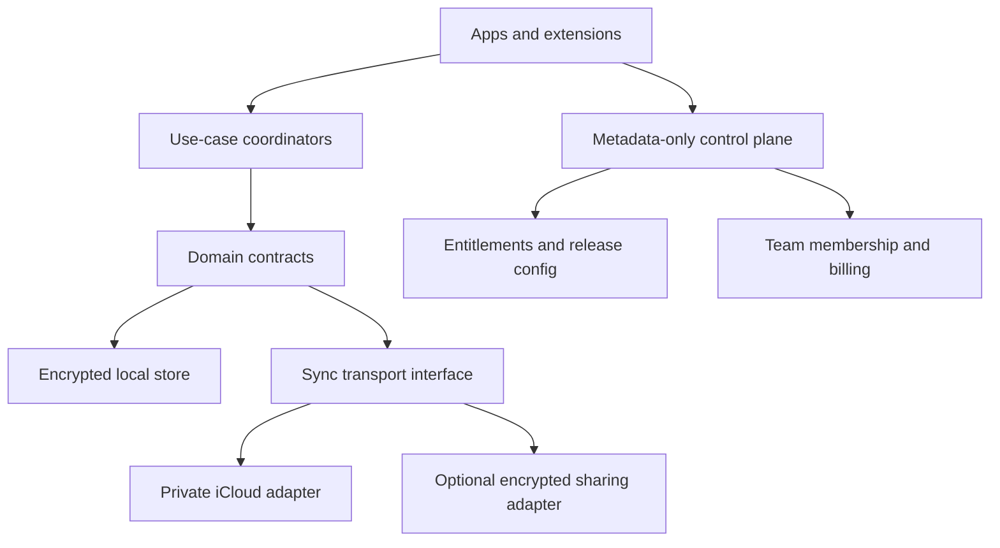

# Gancho scale-readiness research

> Research snapshot: July 12, 2026. This document is an evidence-based product
> and architecture recommendation, not a commitment to ship every item.

## Executive decision

Gancho is technically ahead of a typical pre-release clipboard manager. It has
encrypted local storage, rich capture, fast retrieval, iCloud sync, Apple
platform companions, on-device intelligence, a CLI/MCP surface, StoreKit
plumbing, signed distribution, and unusually strong privacy invariants.

The next constraint is not the number of features. It is launch safety,
addressable-market reach, a sharper reason to switch, and a repeatable path from
first value to purchase.

The recommended strategy is:

1. **Block public paid scale until direct-download licensing is redesigned.**
   The release build currently embeds the private key used to mint offline Pro
   tokens. A key inside a distributed app is recoverable and cannot be treated
   as secret.
2. **Broaden OS eligibility before spending heavily on acquisition.** Gancho
   requires macOS 26 and iOS 26 while established alternatives support much
   older systems. Use capability gates for new Apple intelligence and visual
   APIs instead of making them the product-wide deployment floor.
3. **Own “private, actionable work memory,” not “clipboard history.”** History,
   search, pins, paste stacks, iCloud sync, and even local MCP are already
   present in competitors. Gancho can differentiate through verifiable privacy,
   on-device understanding, developer actions, safe agent access, and reusable
   workflows.
4. **Turn the architecture into a product-learning system.** Preserve the
   content-free data plane, but add a minimal metadata-only commercial control
   plane for secure entitlement issuance, release cohorts, experiments,
   support, and eventually team membership.
5. **Sequence growth features by switching friction and retention.** Ship a
   guided migration experience, project/app-aware workflows, and scoped agent
   actions before broad platform expansion. Build shared team libraries only
   after individual retention is proven.

“Mass sales” cannot be guaranteed by a roadmap. The practical goal is to make
Gancho safe to sell, easy to adopt, meaningfully different, measurable without
breaking trust, and capable of supporting recurring value.

## What was inspected

This assessment reviewed the current repository rather than relying only on
public copy:

- the module graph in `Packages/GanchoKit/Package.swift`;
- macOS and iOS composition roots and major views;
- GRDB schema migrations, encrypted blob storage, archive/import paths, sync
  adapters, and frozen client facets;
- StoreKit, Lemon Squeezy activation, entitlement enforcement, paywall rules,
  and release scripts;
- privacy, architecture, security, product-truth, integration, localization,
  and release documentation;
- the website, pricing, onboarding, telemetry schema, and current free/Pro
  boundaries; and
- the public positioning and current capabilities of Paste, PastePal, Raycast,
  Maccy, and CleanClip.

Repository evidence is referenced by path so every claim can be checked against
the implementation.

## Current product baseline

| Area | Evidence in Gancho | Assessment |
| --- | --- | --- |
| Privacy | `docs/SECURITY-MODEL.md`, SQLCipher, sensitive-type veto, content-free telemetry types | A credible differentiator if independently verified and communicated simply |
| Core utility | rich capture, FTS5, paste-back, pins, boards, snippets, paste stack | Competitive baseline is already present |
| Intelligence | local classification, OCR, embeddings, Q&A, Smart Paste, Dev Actions | Strongest product wedge, but the value must be demonstrated in the first session |
| Apple ecosystem | macOS, iPhone/iPad, extensions, App Intents, CKSyncEngine | Broad surface, but all targets currently require OS 26 |
| Portability | `SyncEngine`, `GanchoClientStore`, archive/export, CLI/MCP | Good seams; no non-Apple or shared-cloud transport exists yet |
| Monetization | StoreKit 2, Lemon Squeezy, lifetime Pro, tier enforcement | Mechanically advanced, but direct-download signing is unsafe and the value ladder is narrow |
| Product learning | closed, content-free telemetry enum with explicit consent | Privacy-safe foundation; insufficient attribution, cohort, and experiment infrastructure for scaled acquisition |
| Distribution | signed/notarized DMG, Sparkle, Homebrew assets, website, release QA | Strong direct channel; App Store/TestFlight and commercial launch remain incomplete |
| Localization | English and Spanish gates | Good LATAM start; limited for global consumer distribution versus multilingual incumbents |

The codebase is also substantial for a pre-release product: roughly 42,000
Swift/YAML lines in app, package, and test surfaces at this snapshot, with 110
Swift test files and hundreds of Swift Testing declarations. This reduces basic
implementation risk, but increases the cost of changing product direction.

## Market reality

The category is validated, but most baseline features are no longer a moat.

| Product | Current public evidence | Implication for Gancho |
| --- | --- | --- |
| Paste | Markets infinite history, search, pinboards, multi-item paste, editing, Apple-device sync, private iCloud, shared team pinboards, and 16K+ ratings. It offers individual subscriptions/lifetime purchase, Teams, an affiliate program, and a local MCP integration for Claude, Codex, and Cursor. | Gancho cannot lead with history, boards, Apple sync, paste stack, or MCP alone. Distribution and collaboration are part of the competitive product. |
| PastePal | $14.99 one-time universal purchase, iCloud sync, family sharing, local-network peer share, 35+ languages, macOS 12/iOS 16 support, and a separate business-friendly Mac license. | Gancho's $19.99 lifetime price is plausible, but OS 26 and two languages materially narrow the funnel. Peer-to-peer sharing is an attractive privacy-preserving benchmark. |
| Raycast | Includes encrypted local clipboard history in a much broader free productivity product and sells a larger Pro/Teams platform. | A standalone clipboard app must win on depth, trust, and workflow outcomes rather than basic retrieval. |
| Maccy | Free, MIT-licensed, lightweight, keyboard-first, private, and supports macOS 14+. | Free/open-source/basic history is already a strong substitute. Gancho must sell outcomes beyond the local history loop. |
| CleanClip | Markets paste stack, smart lists, collections, formatting, quick access, and app-aware behavior. | Paste sequencing and collections are table stakes; app/project context is a promising direction only if Gancho makes it substantially more automatic. |

Primary sources:

- [Paste product and pricing](https://pasteapp.io/)
- [Paste for Teams](https://pasteapp.io/teams)
- [Paste MCP and AI tools](https://pasteapp.io/mcp)
- [Paste affiliate program](https://pasteapp.io/affiliate)
- [PastePal product and pricing](https://indiegoodies.com/pastepal)
- [Raycast clipboard history](https://www.raycast.com/core-features/clipboard-history)
- [Raycast pricing](https://www.raycast.com/pricing)
- [Maccy](https://maccy.app/)
- [CleanClip](https://cleanclip.cc/)

### Competitive conclusion

The most defensible positioning is:

> **Gancho is the private, actionable memory for everything you copy: find it,
> understand it, transform it, and safely reuse it across your work.**

The initial ideal customer should remain Mac developers and AI-heavy knowledge
workers. They have high copy/paste frequency, understand the value of local
tools, can appreciate scoped MCP access and developer actions, and are more
likely to pay for saved time. The product language can stay broad, but the first
acquisition loops should be specific.

Trying to market to “everyone who copies” at launch would dilute the strongest
proof. A focused wedge can later expand to writers, support teams, recruiters,
designers, and operations users through workflow packs and shared libraries.

## Release blockers

### P0 — Remove the private signing key from distributed builds

`LicenseSigningKey.swift`, `LicenseActivation.swift`, `project.yml`, and
`docs/RELEASING.md` show that the direct-download release injects an Ed25519
private key into the app bundle. After Lemon Squeezy validates a key, the client
uses that embedded private key to mint an offline lifetime token.

Code signing prevents undetected modification of the shipped app; it does not
make bundle data secret. A user can inspect their own installed bundle and
recover the signing material. Once recovered, the key can mint arbitrary Pro
tokens that the embedded public key will accept.

Required design:

1. The app contains only a public verification key.
2. A minimal activation endpoint validates the Lemon Squeezy license, enforces
   activation limits, and signs a short, versioned entitlement token server-side.
3. The app stores the signed token and verifies it offline, preserving offline
   startup and graceful network failure.
4. The request contains commercial metadata only: license key, product/version,
   and an opaque install public key or salted fingerprint. It never contains
   clipboard content, search text, source-app names, or board data.
5. Lemon Squeezy webhooks update license state. Revocation can be checked on a
   long grace interval, not on every launch.
6. Signing keys live in a managed secret store, support rotation via `kid`, and
   never enter build artifacts or CI logs.

This endpoint can be a tiny serverless function. “No Gancho content server”
remains true because licensing is a control-plane concern, not a clipboard data
transport.

Acceptance evidence:

- static inspection of the DMG finds no private entitlement key;
- a valid key can activate within its seat limit;
- forged, replayed, expired, revoked, or wrong-device tokens fail predictably;
- an already activated client starts offline;
- key rotation accepts an overlap window; and
- telemetry/logging tests prove that activation never receives clipboard data.

### P0 — Complete a real purchase and recovery matrix

Before paid acquisition, verify both distribution channels end to end:

- fresh purchase, cancel, restore, reinstall, second device, Family Sharing,
  refund/revocation, offline launch, clock skew, and unavailable store;
- direct checkout, successful activation, exhausted seats, deactivation,
  reinstall, lost-device recovery, invalid key, provider outage, and signing-key
  rotation; and
- a clean upgrade path between direct and App Store builds without silently
  downgrading or duplicating a purchase.

The current product-truth discipline should be extended to commercial claims:
the website must not say a channel is purchasable until the exact artifact and
recovery paths have passed.

### P0 — Quantify and reduce the OS 26 acquisition penalty

Both `project.yml` and `Package.swift` set macOS/iOS 26 as the minimum. PastePal
publicly supports macOS 12 and iOS 16; Maccy supports macOS 14+. Requiring the
newest major OS excludes compatible hardware and conservative upgrade cohorts
before they can try Gancho.

Run a two-week compatibility spike:

1. Inventory every OS-26-only API in app and package targets.
2. Separate **core availability** from **enhanced capability**. Capture, FTS,
   paste-back, boards, snippets, encryption, and basic sync should not inherit
   the deployment floor of Liquid Glass or Foundation Models.
3. Evaluate macOS 14/iOS 17 as the preferred floor and macOS 15/iOS 18 as the
   fallback. Use `#available` and capability reporting for on-device AI and new
   visual effects.
4. Add CI build/test lanes for the oldest supported runtime and latest runtime.
5. If lowering the floor is disproportionately expensive, publish the measured
   excluded share and make the restriction an explicit strategic decision.

Do not guess at compatibility by changing only the deployment target. The spike
must produce a source/API inventory and working old-runtime smoke build.

### P1 — Establish support and incident paths before acquisition

At scale, privacy bugs, sync failures, licensing failures, and data recovery are
commercial incidents. Add:

- a support address and public response expectations;
- a signed security contact and vulnerability disclosure flow;
- an in-app content-free diagnostic export with a stable schema;
- a lost-history recovery guide and backup health check; and
- release rollback, kill-switch, and minimum-supported-version procedures.

Remote configuration must never be able to weaken capture vetoes, enable
content telemetry, or turn on external AI processing.

## Recommended target architecture

Gancho should keep clipboard content in the local/private data plane while
adding a deliberately tiny commercial control plane.

Content must never cross from the local/private data plane into the control
plane. The interface should make that impossible by type, as the current
`TelemetryEvent` design already does for analytics.

### 1. Shrink the composition roots

The macOS `AppModel.swift` is about 1,600 lines and owns storage, capture,
classification, sync, licensing, telemetry, settings, retention, app lifecycle,
window controllers, paste-back, and UI state. `IOSAppModel.swift` is about 800
lines. Several primary views are 700–1,200 lines.

This concentration makes growth experiments risky because a change to
entitlements, onboarding, sync, or capture touches the same central object.

Incremental extraction order:

1. `EntitlementController`: StoreKit/direct-license state and feature access.
2. `AppLifecycleCoordinator`: startup, wake, timers, maintenance, termination.
3. `CaptureCoordinator`: monitor, policy, classification, persistence, and
   capture events.
4. `HistoryCoordinator`: retrieval, paste-back, stack, search history, and
   deletion.
5. `PrivacyController`: consent, diagnostic events, private mode, and
   screen-share behavior.

Keep a small `@Observable` shell-facing state projection. Coordinators should
expose narrow commands and state streams, not the full concrete store. Move one
behavior with its existing tests at a time; do not perform a flag-day rewrite.

### 2. Make application orchestration transport-neutral

`GanchoAppCore` is described as platform-neutral but currently depends on and
imports `GanchoSync`; its `SyncController` calls CloudKit-specific entitlement
logic and a concrete production factory. That dependency points the application
layer toward an infrastructure adapter.

Move `SyncEngineFactory`, CloudKit entitlement checks, and iCloud account checks
to the app composition root. `GanchoAppCore` should depend only on:

- `SyncEngine`/`SyncStatus` domain contracts;
- an injected engine factory;
- a capability/entitlement value; and
- an injected state-store abstraction.

That change makes a future encrypted team transport, LAN transport, or test
transport additive instead of conditional logic inside the shared application
layer.

### 3. Split storage migrations and product queries from the GRDB gateway

`GRDBClipboardStore.swift` is about 1,000 lines and currently contains 17
sequential migrations plus storage operations and performance-oriented queries.
The frozen capability facets are a strong boundary; preserve them.

Recommended internal split:

- `DatabaseBootstrap` and one migration file/type per schema version;
- repositories for clips, boards, snippets, search, embeddings, and sync state;
- explicit transaction-level use cases for operations that cross repositories;
  and
- migration fixtures from representative old releases, including encrypted
  stores and interrupted migration recovery.

Do not expose GRDB records through public contracts. The goal is change
isolation and recovery confidence, not a new generic repository abstraction.

### 4. Version the portable content and sync envelope before adding clients

`GanchoArchive` is versioned and checksummed, and `SyncEngine` is a useful
boundary. Before a second transport or non-Apple client, define a canonical
wire contract independent of GRDB and CloudKit:

- stable IDs, content kinds, representations, board membership, tombstones,
  retention, and sensitivity semantics;
- explicit schema version and feature/capability negotiation;
- deterministic encoding plus golden fixtures in another language;
- end-to-end encryption envelope with algorithm/key identifiers;
- forward-compatible unknown-field behavior; and
- idempotency, conflict, and deletion rules.

The archive format and sync protocol may share domain DTOs, but an export
archive should not accidentally become the live replication protocol.

### 5. Replace the closed Dev Actions switch with a safe action registry

`DevActions.swift` is over 600 lines with a closed action enum, kind mapping,
and implementations in one type. That is manageable for the current pack but
will become a merge and release bottleneck if workflows are the growth wedge.

Introduce an internal `ClipAction` contract with:

- stable identifier, version, localized metadata, supported input/output kinds,
  sensitivity policy, deterministic/offline/network capability, and transform;
- a registry assembled at composition time;
- pure transform packs (developer, writing, data cleanup, support, recruiting);
- App Intent and MCP exposure generated from the same metadata; and
- tests that sensitive inputs cannot reach a network-capable action without an
  explicit per-action approval.

Do not open arbitrary third-party code execution in v1. A first-party registry
creates extensibility without turning a clipboard app into a plugin sandbox.

### 6. Add a typed, privacy-preserving commercial control-plane client

Use separate request types for:

- entitlement activation/refresh;
- signed remote configuration and experiment assignment;
- release compatibility/critical-update metadata; and
- later, team identity/membership.

These types should contain no general-purpose string dictionary. Allowlisted
fields and source tests should prevent content, titles, search terms, source-app
names, file paths, and clip hashes from entering requests. Pin the service's
responsibilities in `docs/SECURITY-MODEL.md` and the product-truth matrix.

### 7. Preserve the trust architecture

Growth work must not weaken:

- sensitive pasteboard veto before content read;
- no silent iOS capture;
- no clipboard content in logs, telemetry, support, or billing;
- local-first operation without an account;
- export/exit for Free users;
- explicit opt-in for sync and external processing; and
- exact, visible scopes for MCP/agent access.

These constraints are part of the product, not engineering overhead.

## Product bets, in priority order

### Now — improve adoption and conversion without a new data service

#### 1. Guided migration and switching proof

`ClipImporter` already supports CSV and read-only Maccy database imports, but
the production UI exposes only Gancho archive restore. Turn the existing engine
into an onboarding migration assistant:

- detect supported local sources without reading them until approved;
- preview counts and supported/unsupported representations;
- import Maccy and generic CSV with dedupe and a dry run;
- provide documented export bridges for Paste/PastePal when their formats allow;
- show a post-import “your memory is ready” result; and
- never modify the source database.

This is high leverage because it removes accumulated-history loss, one of the
largest switching costs in this category.

#### 2. Project and app contexts

Make Gancho understand the work context without uploading content:

- optional rules by source app, URL host, content kind, time window, and manual
  project mode;
- automatic local views such as “current project,” “copied from Xcode,” or
  “links for this research session”;
- per-context retention and paste formatting;
- one-command promotion of a session into a board; and
- local suggestions that are always reversible.

This turns capture into a workflow outcome and creates a stronger daily habit
than an undifferentiated chronological list.

#### 3. Agent access that is safer and more useful than generic MCP

Paste now advertises a local MCP server, so protocol support is not enough.
Differentiate on control and auditability:

- per-client grants, expiring sessions, read/write separation, board scopes,
  time ranges, and sensitive-content vetoes;
- a visible local access ledger with revoke-now controls;
- citations back to clip IDs/timestamps in agent results;
- user-approved actions such as save, organize, redact, and transform; and
- reusable “context packs” that expose a chosen board rather than all history.

The promise should be “useful context with least privilege,” not “your entire
clipboard available to AI.”

#### 4. Activation and retention loop

The onboarding demonstrates live capture and paste-back, which is a good start.
Complete the loop with:

- permission recovery after skip/deny;
- an interactive first search and first transform;
- a visible saved-time or successful-reuse summary computed locally;
- lifecycle prompts only after value moments; and
- a lightweight in-app feedback path that never attaches content by default.

### Next — create paid recurring value

#### 5. Private workflow packs

Ship curated, local action/rule packs for developers, support, writers,
recruiters, and operations. Packs combine detection, transforms, templates,
retention, and context rules. They make the intelligence layer understandable
and marketable without requiring a cloud model.

Examples:

- developer: decode/format/redact/test payloads and keep per-repository context;
- support: detect ticket/order IDs, mask PII, and prepare response snippets;
- writing: collect research, deduplicate quotes/links, and transform tone; and
- recruiting: organize candidate links while enforcing short PII retention.

#### 6. Encrypted shared libraries, not shared raw history

For teams, start with intentionally promoted snippets, templates, and boards.
Do not sync every employee's raw clipboard into a company space.

Required properties:

- client-side encryption with per-space keys;
- roles, membership, device removal, and key rotation;
- item provenance and version history;
- no sensitive clips or personal history by default;
- admin policy for retention and allowed integrations; and
- a clear boundary between personal iCloud history and team libraries.

This can support per-seat revenue while preserving the local-first product
story. Validate demand with design partners before building the service.

### Later — expand only after retention evidence

#### 7. Cross-platform companion

Start with a read/search/paste library companion for Windows, not a full
clipboard parity rewrite. The versioned client contract, portable envelope, and
shared-library transport should exist first. A full Android/Windows/Linux
capture engine is a separate product investment.

#### 8. Privacy-preserving local or LAN sync

PastePal already markets peer sharing. A direct local-network transfer could be
a valuable differentiator for users who do not want iCloud, but it should
follow a threat model covering discovery, pairing, replay, device revocation,
and untrusted networks.

## What not to prioritize now

- native watchOS or visionOS experiences beyond low-cost compatibility;
- a general third-party plugin marketplace;
- a hosted external-AI chat that weakens the on-device story;
- full Android/Windows capture before the wire contract and PMF evidence;
- social/community features unrelated to reuse workflows; or
- cosmetic feature volume that does not improve activation, weekly reuse, or
  conversion.

## Monetization recommendation

The current free tier—one year/10,000 items plus core local utility—is a strong
distribution product. Do not reduce it reflexively. First measure whether users
reach value and whether Pro features solve a recurring problem.

Recommended ladder:

| Offer | Value | Revenue model |
| --- | --- | --- |
| Free | excellent local history, search, paste-back, privacy, basic boards/actions | distribution and trust |
| Personal Pro | unlimited library/history, iCloud sync, advanced on-device intelligence, workflow packs, advanced automation | lifetime purchase can remain for local-only value |
| Pro Services | optional encrypted service features, cross-platform/shared access, continuing premium packs | annual plan only when recurring service value exists |
| Teams | shared encrypted libraries, roles, policy, centralized billing, support | per-seat recurring |

A $19.99 lifetime launch price can acquire early adopters, but it should not be
the only long-term revenue engine if Gancho later operates sync, collaboration,
support, and entitlement infrastructure. Honor every sold lifetime promise.
Charge recurring fees only for clearly recurring value.

MIT licensing is compatible with this model: monetize trusted signed builds,
convenience, ongoing updates, optional services, collaboration, and support.
Changing the existing license retroactively would damage the trust advantage
and would not remove already granted rights.

## Growth and product-learning system

### North-star and funnel

Use **weekly successful reuses per activated user** as the primary behavior
metric. A successful reuse is a paste-back, explicit copy from history, snippet
insertion, approved agent retrieval, or action result that the user uses.

Track only closed-schema, content-free events after explicit consent:

1. install/source bucket and compatible OS/capability bucket;
2. onboarding started/completed/skipped;
3. first capture, first search, first successful reuse, first board/snippet;
4. day-1/day-7/day-30 active cohort;
5. paywall trigger, checkout start, purchase/activation result class;
6. feature-family use—not action input, query, title, source app, or clip hash;
7. sync health state and recovery outcome class; and
8. uninstall feedback only when explicitly submitted.

The event schema should include app version, channel, experiment ID, and broad
capability bucket, but no persistent cross-app identity. Document retention and
deletion for telemetry data.

### Growth loops

- **Migration loop:** switching guides and comparison pages convert existing
  clipboard-manager users.
- **Developer loop:** MCP setup, CLI, VS Code integration, and workflow packs
  produce demos worth sharing.
- **Trust loop:** public threat model, reproducible claims, and third-party
  security review improve conversion for a sensitive-data product.
- **Creator loop:** an affiliate program and useful workflow templates give
  productivity creators a concrete story. Paste currently offers 25% on annual
  referrals, demonstrating that this channel is active in the category.
- **Team loop:** a personal board can be intentionally promoted to an encrypted
  shared library, inviting collaborators without exposing history.

## Proposed 90-day sequence

### Days 0–14: make selling safe

- replace embedded client-side entitlement signing;
- complete direct/App Store purchase and recovery test matrices;
- close App Store/TestFlight and support-account launch prerequisites;
- run a targeted security review of licensing, update signing, archive restore,
  and sync encryption; and
- add commercial claims to the product-truth contract.

**Gate:** no paid-scale launch until the shipped artifact contains no private
license key and both purchase channels have reproducible recovery evidence.

### Days 15–35: widen and activate the funnel

- complete the OS compatibility spike and choose a lower deployment floor;
- expose the existing Maccy/CSV importer through guided onboarding;
- instrument the consented activation funnel;
- add permission recovery and first-search/first-action guidance; and
- create focused developer and privacy landing pages.

**Gate:** a new user on every supported minimum OS can install, capture, find,
and reuse a clip without maintainer intervention.

### Days 36–60: prove differentiated retention

- ship project/app contexts and the first workflow packs;
- harden MCP scopes, access ledger, and context packs;
- interview retained and churned beta users; and
- test Pro positioning around sync, intelligence, and automation rather than
  history scarcity.

**Gate:** retained users repeatedly use at least one behavior that free Maccy or
Raycast does not satisfy for them.

### Days 61–90: build repeatable distribution

- publish App Store and direct channels with channel-safe entitlements;
- launch comparison/migration content and an affiliate beta;
- request ratings only after repeated successful reuse;
- recruit a small set of team design partners; and
- write the encrypted shared-library protocol before service implementation.

**Gate:** acquisition source, activation, retention, and purchase conversion are
measurable through consented, content-free cohorts.

## Architecture work mapped to business outcomes

| Change | User/business outcome | Priority |
| --- | --- | --- |
| Server-side entitlement signing | prevents trivial license forgery and enables seat recovery | P0 |
| Lower OS floor with capability gates | materially increases eligible installs | P0 |
| Smaller composition roots | safer/faster onboarding, paywall, sync, and lifecycle experiments | P1 |
| Transport-neutral app core | lowers the cost of shared cloud/LAN/non-Apple clients | P1 |
| Versioned wire envelope | prevents data migration and compatibility failures | P1 before second transport |
| Split migration/query internals | reduces release risk as stored user history grows | P1 |
| Typed commercial control plane | enables safe licensing, cohorts, config, and teams without content access | P1 |
| Action registry and workflow packs | creates differentiated, repeatable paid value | P1 |
| Encrypted shared libraries | enables per-seat revenue after PMF | P2 |

## Validation experiments before large builds

1. **Compatibility:** build the current core at lower deployment targets and
   count actual incompatible APIs and replacement effort.
2. **Positioning:** run landing variants for “private clipboard,” “actionable
   work memory,” and “clipboard for AI/developers”; compare install-to-activation,
   not clicks alone.
3. **Migration:** offer a concierge Maccy migration to ten users; measure whether
   imported history increases week-one reuse.
4. **Workflow packs:** prototype three packs as static first-party actions/rules;
   measure repeat use before building a marketplace.
5. **Teams:** interview at least five small teams using shared snippets or Paste
   Teams; test willingness to promote selected content, not raw history.
6. **Pricing:** test current lifetime Pro against higher-value packaging. Never
   A/B a misleading crossed-out price or change terms after purchase.

## Final recommendation

Gancho should launch as a focused, trustworthy utility for Mac developers and
AI-heavy knowledge workers, with a broad product promise but a narrow initial
distribution story. Its best assets are the parts competitors cannot reproduce
with a landing-page claim alone: hard privacy boundaries, encrypted local data,
useful on-device intelligence, a tested engine, and least-privilege integrations.

The immediate work is commercial safety and reach—not more surface area. Fix
licensing, lower the compatibility floor, expose migration, measure the first
reuse loop, and turn local intelligence into project-aware workflows. Once
individual retention is proven, encrypted shared libraries and a metadata-only
control plane can create recurring team revenue without turning Gancho into a
cloud clipboard that contradicts its reason to exist.
