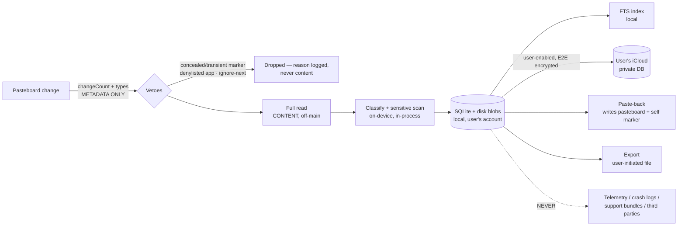

# Gancho — Threat Model & Data-Flow Privacy Spec

The promise: clipboard content lives on the user's devices (and, when THEY
enable sync, in THEIR iCloud private database). Nothing else, ever. This
document is the engineering contract behind that promise; the Privacy
Center, App Store privacy labels, and support answers all derive from it.

## Data flow (content vs metadata)

Content exists in exactly four places: the pasteboard itself, the local
store (rows + content-addressed blobs), the user's iCloud private database
(opt-in, `encryptedValues`), and user-initiated exports. Everything else —
ignore events, purge logs, activation metrics, future telemetry — is
counters and timestamps by construction (the types carry no content field).

## Threat table

| Threat | Mitigation | Verified by |
| --- | --- | --- |
| Password-manager copies entering history | `org.nspasteboard` veto BEFORE any read + preloaded bundle denylist | unit tests (manager type shapes), opt-in real-pasteboard test |
| Secrets copied by accident | on-device detector → masked stored preview + 10-min expiry | 28-pattern suite |
| Screen sharing exposing the panel | private mode + share auto-pause (no `NSWindow.sharingType` — breaks DisplayPort, Maccy #1136) | unit tests on the pause path |
| Content leaking into logs/crashes | NO logging APIs in engine modules; debug prints content-free | automated source sweep (`NoContentLoggingTests`) |
| Extensions corrupting/duplicating the store | extensions never open SQLite; file-inbox handoff, app-side dedupe | inbox unit tests, WAL cross-process test |
| Sync conflicts duplicating or resurrecting clips | hash+device dedupe key, last-writer-wins, tombstones | store tests; on-device verification checklist for the live path |
| External AI seeing clips | tier 0/1 are fully on-device; tier 2 (PCC/external) is per-action opt-in, off by default | architecture boundary (`ClipAnnotating`) |
| Exports grabbed by other software | exports are explicit user actions to user-chosen paths; no auto-export | settings/export code path |
| Lost/stolen device | content sits in the OS user account protected by FileVault/iOS data protection; sensitive items already expired in minutes | retention engine tests |
| Support bundles leaking content | support/diagnostics may include settings snapshot + counters ONLY (snapshot is content-free by schema) | `SettingsSnapshotTests.contentFree` |

## Release checklist (blocks the release if any item fails)

1. `make test` green — includes the no-content-logging sweep, localization
   gate, and masking suites.
2. Grep release diff for new `print(`/`Logger`/`os_log` in engine modules —
   the sweep enforces this automatically.
3. Any NEW telemetry event ships counters/buckets only; schema reviewed
   against this document.
4. PrivacyInfo.xcprivacy matches reality (validation lands with the App
   Store compliance ticket).
5. Manual VoiceOver + 1Password smoke (docs/ACCESSIBILITY.md, NOTES queue).

## Public derivability

This file contains no internal planning references and is safe to publish
as-is (it is, deliberately, the long-form version of the website's privacy
page).
