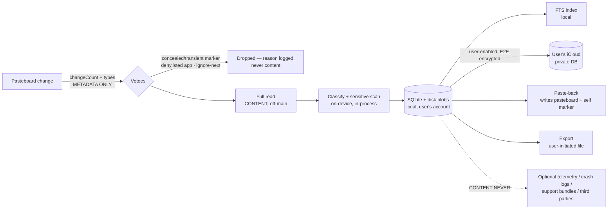

# Gancho — Threat Model & Data-Flow Privacy Spec

The promise: clipboard content lives on the user's devices (and, when THEY
enable sync, in THEIR iCloud private database). Nothing else, ever. This
document is the engineering contract behind that promise; the Privacy
Center, App Store privacy labels, and support answers all derive from it.

## Data flow (content vs metadata)

Content exists in exactly four places: the pasteboard itself, the local
store (rows + content-addressed blobs), the user's iCloud private database
(opt-in, `encryptedValues`), and user-initiated exports. Everything else —
ignore events, purge logs, private activity totals, activation metrics, and explicitly enabled telemetry
— is counters and timestamps by construction (the types carry no content
field). Telemetry is disabled until the user consents and stops immediately
when consent is withdrawn.

The private activity receipt is independent of optional diagnostics. Its
`clip_app_stats` rows contain a validated, bounded bundle identifier, a UTC day,
and integer capture/reuse/skip/protection/expiry counters only. Rows remain on
that device, are pruned beyond a rolling 13 months, never sync or export, and
can be erased from the Privacy Center without deleting clips or changing
settings.

## Optional diagnostics lifecycle and deletion

- Before consent, Gancho keeps only a local activation receipt: the first date
  for each closed milestone and the start date used to derive a coarse
  time-to-value bucket. It contains no clip, query, title, source application,
  path, identifier, or hash. The telemetry SDK is not constructed and no event
  is queued or sent.
- Opting in sends one aggregate activation snapshot, not a replay of individual
  pre-consent actions. Later events are closed enum values and coarse buckets.
  The transport uses only its app-scoped anonymous identifier; Gancho adds no
  account, email, advertising identifier, or cross-app identity.
- Optional diagnostics' per-event counters live in memory and reset on quit.
  Turning diagnostics off clears them, deletes the local activation receipt,
  detaches the sender, and terminates the SDK synchronously. Re-enabling starts
  a new local activation window; disabled-period actions are not backfilled.
- Events already delivered to the diagnostics provider cannot be recalled by
  the client. Server-side retention and deletion are administered in Gancho's
  provider workspace and published privacy policy; this source repository does
  not claim a duration it cannot enforce. Removing Gancho or its preferences
  deletes the remaining local consent and activation data.

## Threat table

| Threat | Mitigation | Verified by |
| --- | --- | --- |
| Password-manager copies entering history | `org.nspasteboard` veto BEFORE any read + preloaded bundle denylist | unit tests (manager type shapes), opt-in real-pasteboard test |
| Secrets copied by accident | on-device detector → masked stored preview + 10-min expiry | 28-pattern suite |
| Screen sharing exposing the panel | private mode + share auto-pause (no `NSWindow.sharingType` — breaks DisplayPort, Maccy #1136) | unit tests on the pause path |
| Content leaking into logs/crashes | NO logging APIs in engine modules; debug prints content-free | automated source sweep (`NoContentLoggingTests`) |
| Extensions corrupting/duplicating the store | extensions never open SQLite; file-inbox handoff, app-side dedupe | inbox unit tests, WAL cross-process test |
| Sync conflicts duplicating or resurrecting clips | hash+device dedupe key, last-writer-wins, tombstones | store tests; on-device verification checklist for the live path |
| External AI seeing clips | tier 0/1 are fully on-device; tier 2 (PCC/external) is per-action opt-in, off by default | architecture boundary (`ClipAnnotating`) |
| Exports grabbed by other software | exports are explicit user actions to user-chosen paths; no auto-export | settings/export code path |
| Lost/stolen device | content sits in the OS user account protected by FileVault/iOS data protection; sensitive items already expired in minutes | retention engine tests |
| Support bundles leaking content | support/diagnostics may include settings snapshot + counters ONLY (snapshot is content-free by schema); the in-app error log (`DiagnosticLog`, the Privacy Center "Recent issues" + "Copy for support") stores a category, a fixed operational message, and a timestamp only — never clip text, capped in memory, never persisted or uploaded | `SettingsSnapshotTests.contentFree`, `DiagnosticLogTests` |
| Private activity receipt grows or becomes a shadow history | `clip_app_stats` accepts bounded bundle IDs plus UTC days and integer counters only; atomic upserts prune beyond 13 months; Privacy Center exposes an independent clear action; the table never syncs or exports | `PrivateActivityReceiptTests` schema, retention, concurrency, and clear coverage |
| Consent withdrawal leaves analytics running | sender detaches under lock, SDK termination runs synchronously, session counters and local activation receipts are erased; a concurrently constructed sender is terminated instead of attached | `TelemetryTests.forwards`, disabled-state and activation-receipt tests |

## Release checklist (blocks the release if any item fails)

1. `make test` green — includes the no-content-logging sweep, localization
   gate, and masking suites.
2. Grep release diff for new `print(`/`Logger`/`os_log` in engine modules —
   the sweep enforces this automatically.
3. Any NEW telemetry event ships counters/buckets only, remains behind explicit
   consent, and has its schema reviewed against this document.
4. PrivacyInfo.xcprivacy matches reality (validation lands with the App
   Store compliance ticket).
5. Manual VoiceOver + 1Password smoke (docs/ACCESSIBILITY.md, NOTES queue).

## Public derivability

This file contains no internal planning references and is safe to publish
as-is (it is, deliberately, the long-form version of the website's privacy
page).
