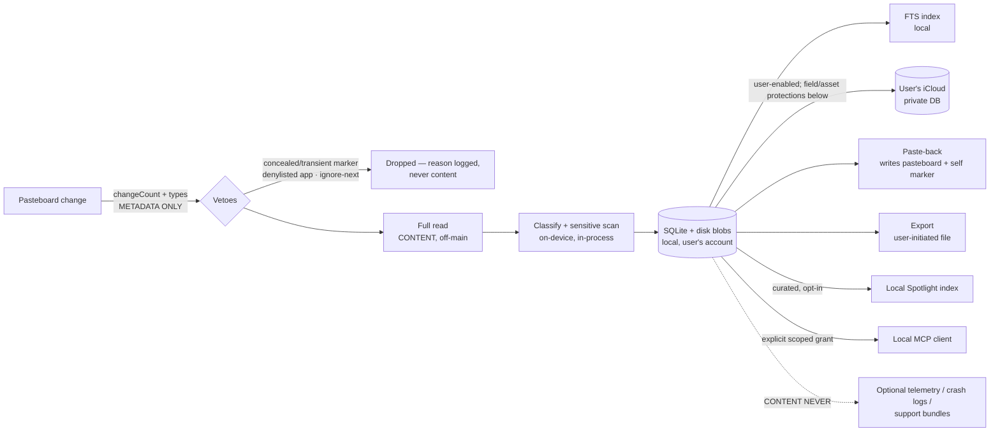

# Gancho — Threat Model & Data-Flow Privacy Spec

Gancho keeps capture and recognition local, with optional sync to the user's
private iCloud database. Explicit exports, paste-back and authorized local-agent
access can deliver content outside Gancho; those recipients have their own
retention and network behavior. This document defines the app's boundaries,
not a guarantee about what an authorized destination does afterwards.

## Data flow (content vs metadata)

```mermaid
flowchart LR
    A[Pasteboard change] -->|changeCount + types\nMETADATA ONLY| B{Vetoes}
    B -->|concealed/transient marker\ndenylisted app · ignore-next| X[Dropped — reason logged,\nnever content]
    B --> C[Full read\nCONTENT, off-main]
    C --> D[Classify + sensitive scan\non-device, in-process]
    D --> E[(SQLite + disk blobs\nlocal, user's account)]
    E --> F[FTS index\nlocal]
    E -->|user-enabled; field/asset protections below| G[(User's iCloud\nprivate DB)]
    E --> H[Paste-back\nwrites pasteboard + self marker]
    E --> I[Export\nuser-initiated file]
    E -->|curated, opt-in| S[Local Spotlight index]
    E -->|explicit scoped grant| M[Local MCP client]
    E -.->|CONTENT NEVER| T[Optional telemetry / crash logs /\nsupport bundles]
```

Primary storage and delivery locations are the pasteboard, the encrypted local
store (rows and content-addressed blobs), the sealed iOS share inbox, optional
private iCloud records, and user-chosen exports. Recognition/review also holds
transient content in process memory; sync asset staging uses lifecycle-bounded
files as described below. Opt-in Spotlight stores sanitized titles/previews of
eligible curated clips in the local system index, not raw history. A scoped MCP
grant permits eligible content to be read by the authorized local client;
Gancho cannot retract bytes already delivered to that client.

Protected outbound surfaces use the same intrinsic-kind rule as passive
presentation: flagged clips and JWT, credit-card and secret kinds remain
protected even when their `isSensitive` flag is false. Drag-out, the keyboard,
and iOS sharing do not provide a reveal step, so they exclude that content.
Lazy payload reads recheck metadata, revision, expiry and cancellation before
delivery; the keyboard also filters before its result limit. iOS sharing loads
the full permitted content, not a cached text preview. Private Mode hides the
macOS fallback menu's previews as well as the panel's.

JSON, CSV and archive export apply this intrinsic rule when excluding sensitive
content. An explicit full export and the app's intentional copy/reveal paths
remain distinct user-controlled operations. Synthetic export, CoreTransferable
and asynchronous-delivery tests exercise these boundaries; they do not certify
every third-party destination or replace device/VoiceOver acceptance.

The inbox is the short-lived handoff from the share extension to the app. That
extension uses the inbox rather than opening the store; it seals captures with the
same content key (`StoreContentKey` → `SealedEnvelope`) and the app unseals it
on the next drain. Without that key the extension refuses to deposit rather
than writing plaintext. Everything else —
ignore events, purge logs, private activity totals, activation metrics, and explicitly enabled telemetry
— is counters and timestamps by construction (the types carry no content
field). Telemetry is disabled until the user consents and stops immediately
when consent is withdrawn.

The private activity receipt is independent of optional diagnostics. Its
`clip_app_stats` rows contain a validated, bounded bundle identifier, a UTC day,
and integer capture/reuse/skip/protection/expiry counters only. Rows remain on
that device, are pruned beyond a rolling 13 months, never sync or export, and
can be erased from the Privacy Center without deleting clips or changing
settings.

## Sync record: encrypted vs plain, field by field

`ClipRecordMapper` is the only code that knows the CloudKit record shape. The
rule it implements: anything that can carry clipboard content rides
`encryptedValues` (end-to-end encrypted in the user's private database);
metadata the sync machinery needs for ordering, conflict resolution, and
dedupe stays plain. CloudKit production schema types are one-way — a plain
field can never become encrypted in place, so moving a field across this line
would mean introducing a NEW field and migrating writers, never converting.

| Field | Placement | Why |
| --- | --- | --- |
| `contentText` | encrypted | The clip body itself. |
| `title` | encrypted | Derived from content (user- or AI-written). |
| `preview` | encrypted | A prefix or masked form of the content. |
| `contentAsset` | `CKAsset` | Binary payloads; CloudKit encrypts assets in transit and at rest server-side. Local staging is plaintext but lifecycle-bounded (see `ClipRecordMapper`). |
| `kind` | plain | Closed enum token; lets a device render list rows without decrypting. |
| `contentHash` | plain | Dedupe/conflict key (SHA-256 of canonical content + kind). Reveals content *equality* across the user's own records, never content; low-entropy content is in principle dictionary-checkable by the storage operator — accepted so dedupe works without decryption. |
| `createdAt` / `updatedAt` / `lastUsedAt` / `expiresAt` | plain | Ordering and last-writer-wins conflict resolution. |
| `sourceAppBundleID` | plain | Provenance: which app the copy came from. A bounded identifier, not content. |
| `sourceDeviceName` | plain | Provenance: which device the copy came from — the OS device name the user set in Settings, stamped at capture, independent of any clip's content. Same class as `sourceAppBundleID`; feeds the `(contentHash, sourceDeviceName)` dedupe key and the iOS detail view. Deployed plain in the production schema; if it ever needed encryption that would be a new encrypted field, not a conversion. |
| `isPinned` | plain | Structural flag. |
| `isSensitive` | plain | Structural flag gating masking/expiry on the receiving device. Reveals *that* something sensitive was copied at a timestamp, never what — accepted so receivers can enforce masking before decryption. |
| `tags` | plain | Today carries only `lang:<id>` snippet-language tokens — a bounded vocabulary, not content. Free-form user tags WOULD be content; placement must be revisited before any user-facing tagging ships. |
| `boardIDs` | plain | Structural membership (UUIDs). Board *names* and emoji sync encrypted on the `Board` record. |
| `contentTypeIdentifier` | plain | UTI from a bounded vocabulary; needed to decode the asset. |

## Optional diagnostics lifecycle and deletion

- Before consent, Gancho keeps only a local activation receipt: the first date
  for each closed milestone and the start date used to derive a coarse
  time-to-value bucket. It contains no clip, query, title, source application,
  path, identifier, or hash. The telemetry SDK is not constructed and no event
  is queued or sent.
- Opting in sends one aggregate activation snapshot, not a replay of individual
  pre-consent actions. Later events are closed enum values and coarse buckets.
  The transport uses only its app-scoped anonymous identifier; Gancho adds no
  account, email, advertising identifier, or cross-app identity.
- Optional diagnostics' per-event counters live in memory and reset on quit.
  Turning diagnostics off clears them, deletes the local activation receipt,
  detaches the sender, and terminates the SDK synchronously. Re-enabling starts
  a new local activation window; disabled-period actions are not backfilled.
- Events already delivered to the diagnostics provider cannot be recalled by
  the client. Server-side retention and deletion are administered in Gancho's
  provider workspace and published privacy policy; this source repository does
  not claim a duration it cannot enforce. Removing Gancho or its preferences
  deletes the remaining local consent and activation data.

## Threat table

| Threat | Mitigation | Verified by |
| --- | --- | --- |
| Password-manager copies entering history | `org.nspasteboard` veto BEFORE any read + preloaded bundle denylist | unit tests (manager type shapes), opt-in real-pasteboard test |
| Secrets copied by accident | on-device detector → masked stored preview + 10-min expiry | 28-pattern suite |
| Screen sharing exposing the panel | private mode + share auto-pause (no `NSWindow.sharingType` — breaks DisplayPort, Maccy #1136) | unit tests on the pause path |
| Content leaking into logs/crashes | NO logging APIs in engine modules; debug prints content-free | automated source sweep (`NoContentLoggingTests`) |
| Extensions corrupting/duplicating the store | the share extension uses a sealed inbox; keyboard and App Intent entry points can open the shared encrypted store through `IntentStore`. Cross-process database coordination and app-side dedupe remain required | inbox unit tests, WAL cross-process test |
| Sync conflicts duplicating or resurrecting clips | hash+device dedupe key, last-writer-wins, tombstones | store tests; on-device verification checklist for the live path |
| External AI seeing clips | tier 0/1 are fully on-device; tier 2 (PCC/external) is per-action opt-in, off by default | architecture boundary (`ClipAnnotating`) |
| Exports grabbed by other software | exports are explicit user actions to user-chosen paths; no auto-export | settings/export code path |
| Lost/stolen device | content sits in the OS user account protected by FileVault/iOS data protection; sensitive items expire on their own. macOS purges every five minutes on a timer. iOS purges on leaving the app and again through an opportunistic background refresh, so a phone that is never opened again narrows to those windows rather than expiring on a schedule iOS does not offer — the background refresh is granted at the OS's discretion, not on request | retention engine tests |
| Support bundles leaking content | support/diagnostics may include settings snapshot + counters ONLY (snapshot is content-free by schema); the in-app error log (`DiagnosticLog`, the Privacy Center "Recent issues" + "Copy for support") stores a category, a fixed operational message, and a timestamp only — never clip text, capped in memory, never persisted or uploaded | `SettingsSnapshotTests.contentFree`, `DiagnosticLogTests` |
| Private activity receipt grows or becomes a shadow history | `clip_app_stats` accepts bounded bundle IDs plus UTC days and integer counters only; atomic upserts prune beyond 13 months; Privacy Center exposes an independent clear action; the table never syncs or exports | `PrivateActivityReceiptTests` schema, retention, concurrency, and clear coverage |
| Consent withdrawal leaves analytics running | sender detaches under lock, SDK termination runs synchronously, session counters and local activation receipts are erased; a concurrently constructed sender is terminated instead of attached | `TelemetryTests.forwards`, disabled-state and activation-receipt tests |

## Release checklist (blocks the release if any item fails)

1. `make test` green — includes the no-content-logging sweep, localization
   gate, and masking suites.
2. Grep release diff for new `print(`/`Logger`/`os_log` in engine modules —
   the sweep enforces this automatically.
3. Any NEW telemetry event ships counters/buckets only, remains behind explicit
   consent, and has its schema reviewed against this document.
4. PrivacyInfo.xcprivacy matches reality before App Store submission.
5. Complete the manual VoiceOver + 1Password smoke in
   `docs/ACCESSIBILITY.md` and attach the evidence to the release record.

## Public derivability

This file contains no internal planning references and is safe to publish
as-is (it is, deliberately, the long-form version of the website's privacy
page).

### Intentional capture authorization

An iOS paste gesture authorizes a read, not an exception to reserved marker
policy. Direct pasteboard reads inspect metadata across all items; system paste
providers inspect the union of provider and pasteboard types before loading any
object. A changed, newly protected or cancelled read is not persisted; in a
multi-item paste, unsupported items are skipped and one failed load does not
discard the readable ones.
Intent/control and keyboard capture reuse the app ingestion coordinator, including
configured local sensitive retention and actual durable duplicate identity. A
failed store open or insert never produces a Saved confirmation. Device-local
retention/intelligence settings are stored in the App Group, so the app and those
extensions read one copy; this is not cross-device preference synchronization.
